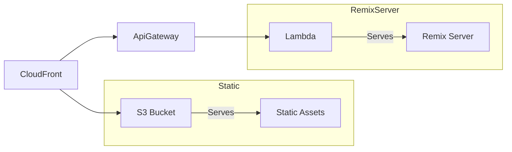

# Remix Lambda Server

This example was created as I was trying to get a Remix app to work on AWS Lambda.

Here is the basic architecture:

## Resources Created by the Pulumi Template

This Pulumi template creates the following AWS resources:

### S3
- **S3 Bucket** (`aws.s3.Bucket`)
    - Purpose: Stores static assets for the Remix application.
    - Configuration: Set to private access.

- **S3 Bucket Synced Folder** (`synced.S3BucketFolder`)
    - Purpose: Syncs the local `../build/client` directory to the S3 bucket.
    - Ensures that the static assets are always up-to-date in the S3 bucket.

- **S3 Bucket Policy** (`aws.s3.BucketPolicy`)
    - Purpose: Allows CloudFront to access objects in the S3 bucket.
    - Restricts access to only the associated CloudFront distribution.

### Lambda
- **Lambda Function** (`aws.lambda.Function`)
    - Purpose: Hosts the Remix server-side rendering logic.
    - Configuration: Uses Node.js 20.x runtime and points to the `index.handler` function.

- **IAM Role** (`aws.iam.Role`)
    - Purpose: Defines the permissions for the Lambda function.
    - Allows the Lambda service to assume this role.

- **IAM Role Policy Attachment** (`aws.iam.RolePolicyAttachment`)
    - Purpose: Attaches the AWS Lambda basic execution policy to the IAM role.
    - Grants necessary permissions for Lambda to execute and log to CloudWatch.

- **Lambda Permission** (`aws.lambda.Permission`)
    - Purpose: Allows API Gateway to invoke the Lambda function.

### API Gateway
- **API Gateway v2** (`aws.apigatewayv2.Api`)
    - Purpose: Creates an HTTP API to expose the Lambda function.
    - Acts as the entry point for HTTP requests to the Remix application.

- **API Gateway Integration** (`aws.apigatewayv2.Integration`)
    - Purpose: Connects the API Gateway to the Lambda function.
    - Uses AWS_PROXY integration type for seamless request/response handling.

- **API Gateway Route** (`aws.apigatewayv2.Route`)
    - Purpose: Defines the routing for the API Gateway.
    - Uses `$default` route key to catch all requests.

- **API Gateway Stage** (`aws.apigatewayv2.Stage`)
    - Purpose: Creates a named stage for the API Gateway.
    - Configures throttling settings and enables auto-deploy.

### CloudFront
- **CloudFront Origin Access Control** (`aws.cloudfront.OriginAccessControl`)
    - Purpose: Secures access to the S3 bucket from CloudFront.

- **CloudFront Distribution** (`aws.cloudfront.Distribution`)
    - Purpose: Serves as the CDN for both static assets and dynamic content.
    - Configures origins for both S3 and API Gateway.
    - Sets up caching behaviors for different path patterns.
    - Handles SSL/TLS configuration based on the deployment stack.

### Route53 (Conditional, only for production)
- **A Record** (`aws.route53.Record`)
    - Purpose: Creates a DNS A record for the main domain.

- **WWW Alias Record** (`aws.route53.Record`)
    - Purpose: Creates a DNS A record for the www subdomain.
