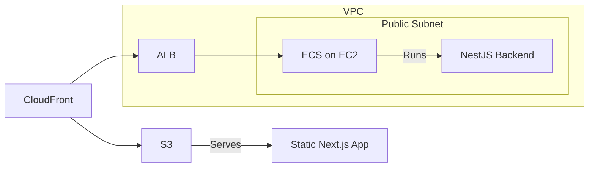

# SPA with Nest.js and Docker and ECS

This example was created as I was working on an SPA with Next, Nest, to be deployed on Docker.

It is mostly working, but there is a small issue with Next.js in SPA mode where HTML documents are
generated for each page, rather than a single HTML document for the entire application. This causes issues when 
deploying with CloudFront/S3, as the user will try to navigate to /chat, where the chat page is available 
at /chat.html, causing a 403 error. 

This example should work if Next.js was replaced with an actual SPA such as Vite, and is still interesting for the
Nest on Docker with ECS on EC2 part, which is perfectly working.

Here is the basic architecture:

## Infrastructure diagram

Additionally, this template demonstrate integration with SSM Parameter Store to provide environment variables, which are used to store the API Access Token and Claude API Key.

## Resources Created by the Pulumi Template

This Pulumi template creates the following AWS resources:

### VPC and Networking
- **VPC** (`aws.ec2.Vpc`)
    - Purpose: Provides an isolated network environment for the ECS cluster.
- **Internet Gateway** (`aws.ec2.InternetGateway`)
    - Purpose: Allows communication between the VPC and the internet.
- **Public Subnets** (`aws.ec2.Subnet`)
    - Purpose: Host the ECS instances and allow them to have public IP addresses.
- **Route Table** (`aws.ec2.RouteTable`)
    - Purpose: Defines routing rules for the VPC.
- **Route Table Associations** (`aws.ec2.RouteTableAssociation`)
    - Purpose: Associates the route table with the public subnets.
- **Security Groups** (`aws.ec2.SecurityGroup`)
    - One for ALB: Controls inbound and outbound traffic for the Application Load Balancer.
    - One for EC2 instances: Controls inbound and outbound traffic for the ECS instances.
- **Log Group** (`aws.cloudwatch.LogGroup`)
    - Purpose: Stores logs from the ECS tasks.

### ECS (Elastic Container Service)
- **ECS Cluster** (`aws.ecs.Cluster`)
    - Purpose: Logical grouping of EC2 instances to run Docker containers.
- **ECS Task Definition** (`aws.ecs.TaskDefinition`)
    - Purpose: Specifies the Docker container configuration for the Nest.js backend.
- **ECS Service** (`aws.ecs.Service`)
    - Purpose: Ensures that the specified number of tasks are constantly running and connected to the ALB.
- **ECS Capacity Provider** (`aws.ecs.CapacityProvider`)
    - Purpose: Links the Auto Scaling Group with the ECS cluster for dynamic scaling.
- **ECS Cluster Capacity Providers** (`aws.ecs.ClusterCapacityProviders`)
    - Purpose: Associates the capacity provider with the ECS cluster.
- **IAM Role for ECS Task Execution** (`aws.iam.Role`)
    - Purpose: Defines permissions for ECS to execute tasks.
- **IAM Role Policy Attachment for ECS** (`aws.iam.RolePolicyAttachment`)
    - Purpose: Attaches necessary policies to the ECS task execution role.

### EC2 (Elastic Compute Cloud)
- **Launch Template** (`aws.ec2.LaunchTemplate`)
    - Purpose: Defines the EC2 instance configuration for the ECS cluster.
- **Auto Scaling Group** (`aws.autoscaling.Group`)
    - Purpose: Manages the EC2 instances, ensuring the desired capacity is maintained.
- **IAM Role for EC2 Instances** (`aws.iam.Role`)
    - Purpose: Defines permissions for the EC2 instances running ECS tasks.
- **IAM Role Policy Attachment for EC2** (`aws.iam.RolePolicyAttachment`)
    - Purpose: Attaches necessary policies to the EC2 instance role.
- **IAM Instance Profile** (`aws.iam.InstanceProfile`)
    - Purpose: Allows EC2 instances to assume the IAM role.

### ALB (Application Load Balancer)
- **Application Load Balancer** (`aws.lb.LoadBalancer`)
    - Purpose: Distributes incoming application traffic across multiple ECS tasks.
- **Target Group** (`aws.lb.TargetGroup`)
    - Purpose: Directs traffic to registered ECS tasks.
- **Listener** (`aws.lb.Listener`)
    - Purpose: Checks for connection requests to the ALB.

### S3 (Simple Storage Service)
- **S3 Bucket** (`aws.s3.Bucket`)
    - Purpose: Stores static assets for the Next.js application.
- **S3 Bucket Synced Folder** (`synced.S3BucketFolder`)
    - Purpose: Syncs local static assets to the S3 bucket.
- **Bucket Policy** (`aws.s3.BucketPolicy`)
    - Purpose: Configures access permissions for the S3 bucket.

### CloudFront
- **CloudFront Distribution** (`aws.cloudfront.Distribution`)
    - Purpose: Serves as a CDN for both static assets from S3 and dynamic content from the ALB.
- **Origin Access Control** (`aws.cloudfront.OriginAccessControl`)
    - Purpose: Secures access to the S3 bucket from CloudFront.

### SSM (Systems Manager)
- **SSM Parameter** (for Claude API Key)
    - Purpose: Securely stores the Claude API key for use in the application.
- **SSM Parameter** (for API Access Token)
    - Purpose: Securely stores the API Access Token for use in the application.
